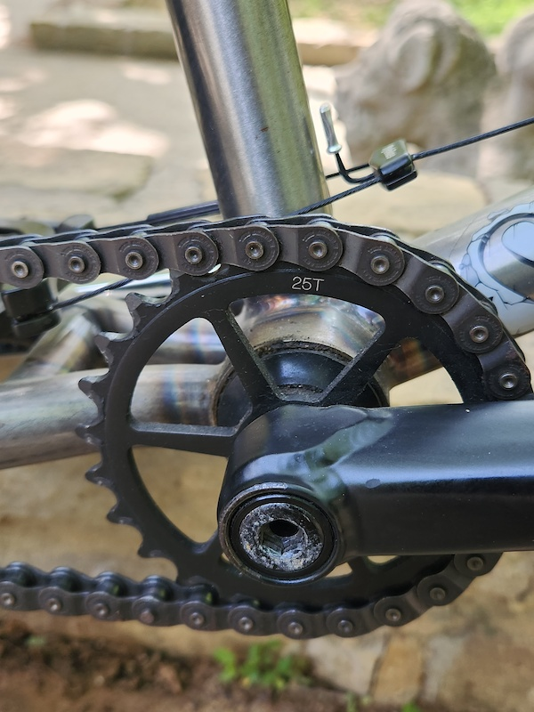
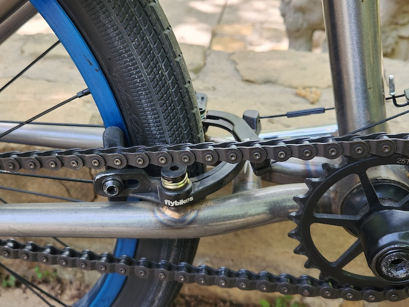
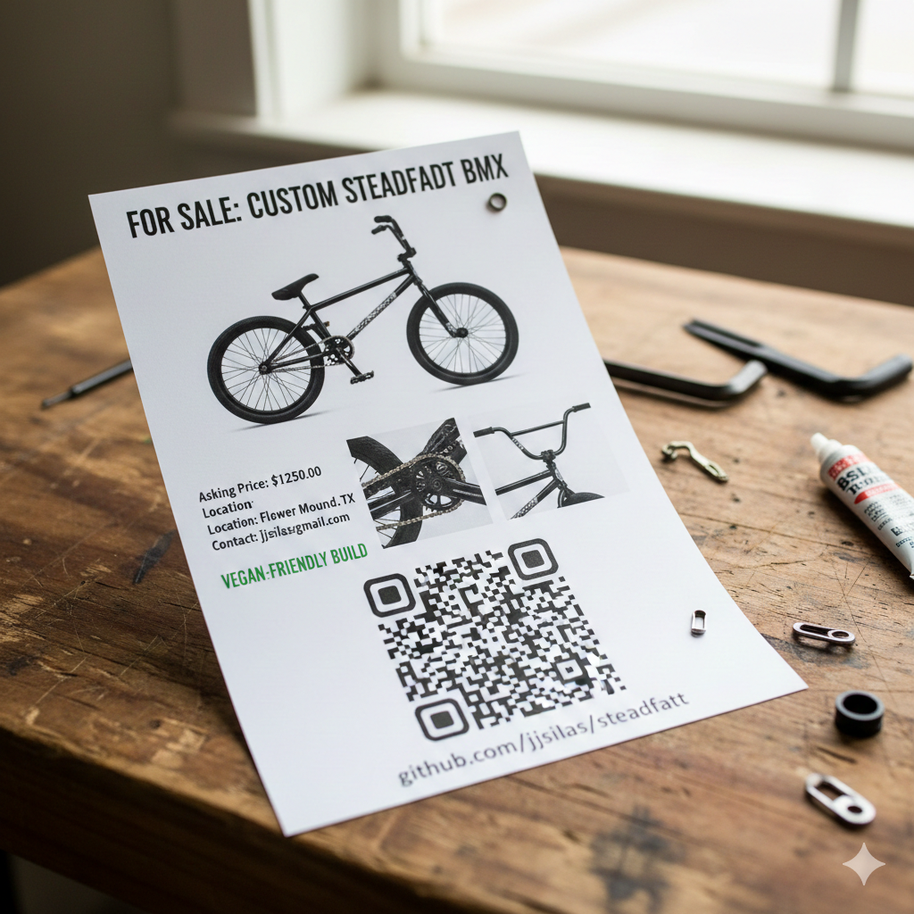

# For Sale: Custom Steadfast

A meticulously maintained build focused on reliability and performance. This bike has been cared for with a "preventative maintenance" mindset, ensuring it's ready to ride immediately.

## Quick Specs
* **Frame:** Steadfast (Size: 20.75)

* **Condition:** Excellent / Well-maintained
* **Location:** Flower Mound, TX (North Texas Area)

## Detailed Build & Parts
* **Drivetrain:** Black/Chromek; One Chrome and One Black Premium Crankarm, Black Shadow Chain

* **Bars:** BSD
* **Forks:** Demolition
* **Brakes:** Fly Manual rear brake

* **Tires:** Maxxis/Tioga
* **Misc Parts:** Wheels and seat by Stolen; Odyssey headset and pedals.

## Maintenance History
* Stored indoors and cleaned after every ride.

## Asking Price: $1250.00
*Local pickup preferred. Shipping available at buyer's expense.*

## Contact Information
If you are interested or have specific questions, please reach out via:
* **Email:** jjsilas@gmail.com
* **Platform:** Direct Message on GitHub

---
*Note: This repository serves as the official documentation and high-resolution image gallery for this sale.*# steadfast
### Scan to share this listing:

